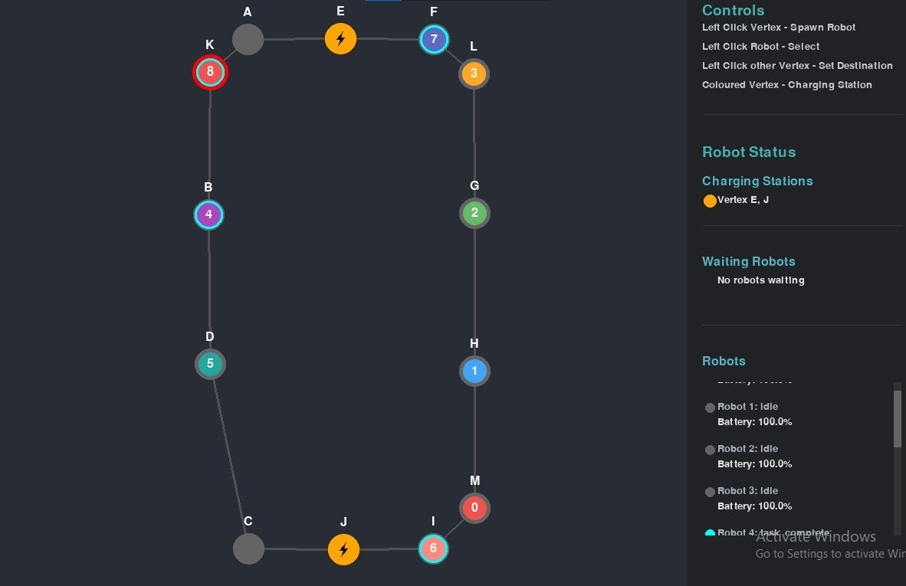
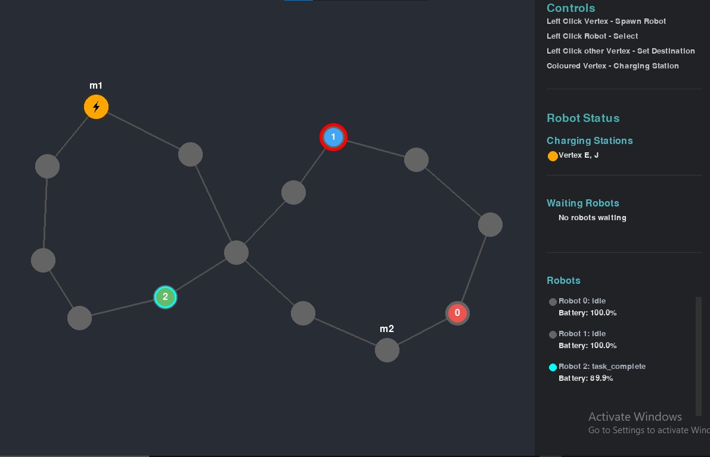
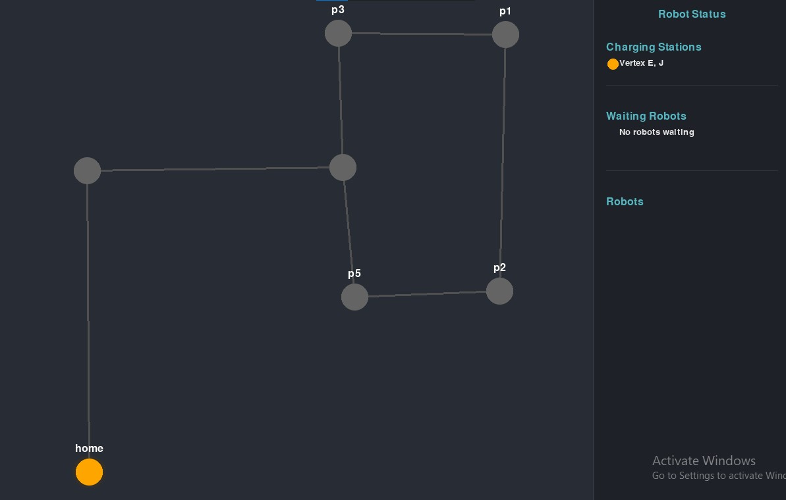

# Fleet Management System

A Python-based Fleet Management System for coordinating multiple robots in a shared environment. The system features real-time visualization, traffic negotiation, and collision avoidance with an interactive GUI built using Python and Pygame.

# first navigation graph


# Second navigation graph


# Third navigation graph



## Features

### Robot Management
- **Robot Spawning**: Click on any unoccupied vertex to spawn a new robot
- **Robot Selection**: Click on an idle or task-complete robot to select it
- **Task Assignment**: Click on a destination vertex after selecting a robot to assign a movement task
- **Multiple Robots**: Support for multiple robots with unique IDs and colors
- **Robot States**:
  - IDLE: Robot waiting for task assignment
  - MOVING: Robot in transit between vertices
  - WAITING: Robot temporarily stopped due to path blockage
  - CHARGING: Robot recharging at a charging station
  - TASK_COMPLETE: Robot finished its assigned task
  - BATTERY_DEAD: Robot's battery depleted, needs charging

### Battery System
- **Battery Level Monitoring**: Each robot has a battery that depletes during movement
- **Low Battery Indicator**: Visual indicator when battery level drops below 30%
- **Automatic Charging**:
  - Robots automatically seek nearest charging station when battery drops below 20%
  - If battery depletes to 0% while moving to charging station, robot stops at current position
  - Charging stations marked with ⚡ symbol
  - Visual feedback during charging process
  - Robot must be manually directed to charging station if battery dies (0%)
- **Battery Dead State**: 
  - Robots stop moving when battery depletes completely
  - Robot remains at the position where battery reached 0%
  - Cannot accept new tasks until charged

### Traffic Management
- **Path Finding**: Automatic calculation of optimal paths between vertices
- **Collision Avoidance**: 
  - Prevention of robot collisions through path reservation system
  - Robots wait when paths are blocked by other robots
  - Only one robot can occupy a vertex at a time
  - Only one robot can traverse an edge at a time
- **Edge Blocking**: Visual indication of blocked paths with red X markers
- **Alternative Paths**: System finds alternative routes when primary path is blocked

### Visual Interface
- **Interactive GUI**: Real-time visualization with modern dark theme
- **Status Panel**: 
  - Robot Status overview
  - Charging Stations information
  - Waiting Robots section
  - Individual robot details including battery levels
- **Visual Indicators**:
  - Color-coded robot states
  - Path previews
  - Blocked path indicators
  - Battery level bars
  - Charging station glow effects
  - Selection highlights with purple highlight
  - Blue vertices for regular locations
  - Yellow vertices for charging stations
  - Green edges for available paths

## Requirements

- Python 3.8+
- Pygame 2.x
- Additional dependencies listed in requirements.txt

## Installation and Running

1. Install dependencies:
```bash
pip install -r requirements.txt
```

2. Run the GUI system:
```bash
cd src
python main.py
```

3. To select a specific navigation graph, use the --graph argument:
```bash

cd src

# For first navigation graph
python main.py --graph 1

# For second navigation graph
python main.py --graph 2

# For third navigation graph
python main.py --graph 3
```

If no graph is specified, it will default to graph 1.

## Using the System

### Basic Controls
1. **Left Click on Vertex**: Spawn new robot (if no robot selected) or set destination (if robot selected)
2. **Left Click on Robot**: Select robot for task assignment
3. **Close Window**: Exit application

### Interface Elements
- Status panel on the right shows detailed robot information
- Notifications appear at the top of the screen
- Each robot has a unique color and status indicator
- Battery levels are shown for all robots
- Charging stations are marked in yellow with a glow effect

## Navigation Graph

The system uses a JSON-based navigation graph (`data/nav_graph.json`) that defines:
- Vertices: Locations with coordinates and attributes
- Lanes: Connections between vertices
- Charging stations: Special vertices marked with `is_charger: true`

## Project Structure
```
fleet_management_system/
├── data/
│   └── nav_graph.json
├── src/
│   ├── models/
│   │   ├── nav_graph.py
│   │   └── robot.py
│   ├── controllers/
│   │   ├── fleet_manager.py
│   │   └── traffic_manager.py
│   ├── gui/
│   │   └── fleet_gui.py
│   └── main.py
├── requirements.txt
└── README.md
```

## Technical Details
- Built with Python and Pygame
- Uses graph-based navigation system
- Real-time path finding and collision avoidance
- Event-driven architecture
- Modular design with separate components for:
  - Fleet Management
  - Traffic Control
  - Robot Control
  - GUI Rendering
  - Navigation
  - Battery Management
- Real-time Updates: 60 FPS update rate for smooth animation
- Performance Optimization: 
  - Double buffering for smooth rendering
  - Efficient path finding algorithms
  - Optimized collision detection 
